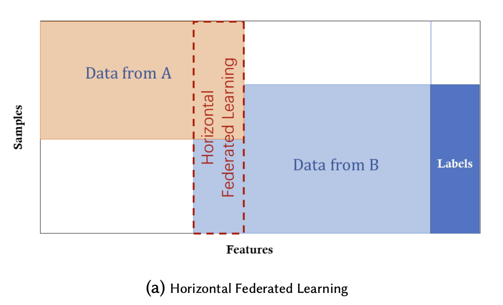
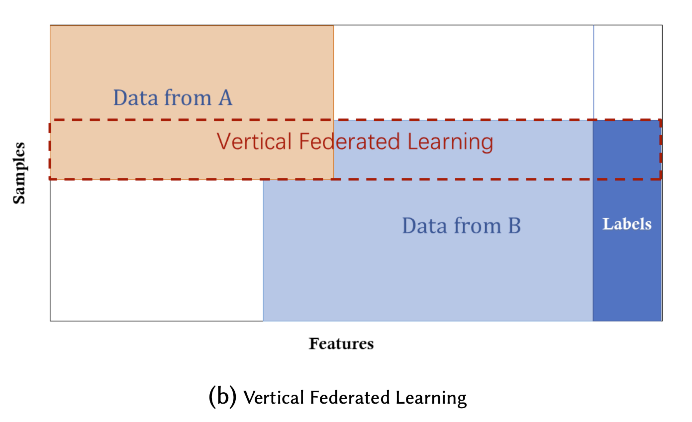
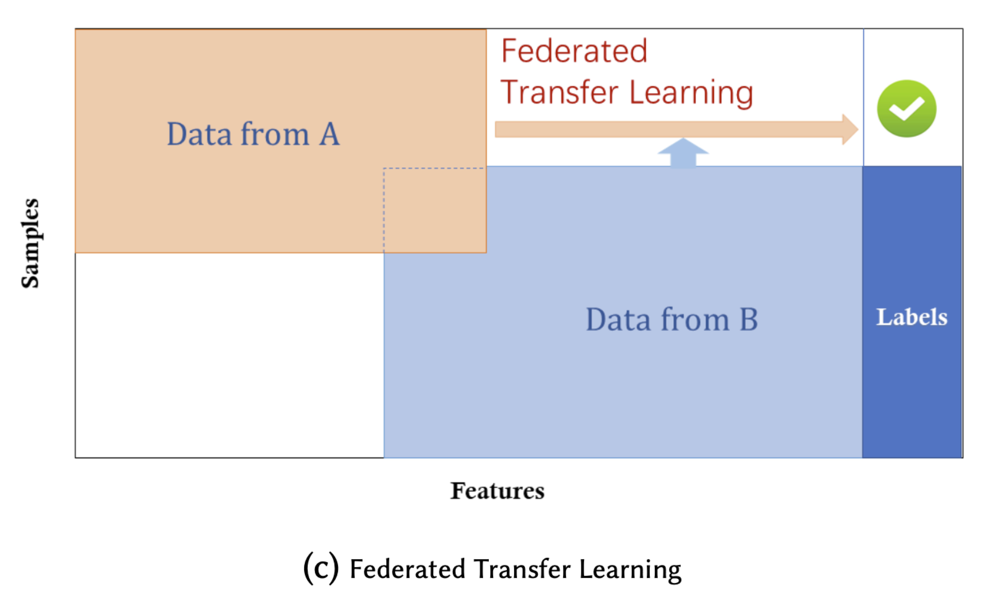
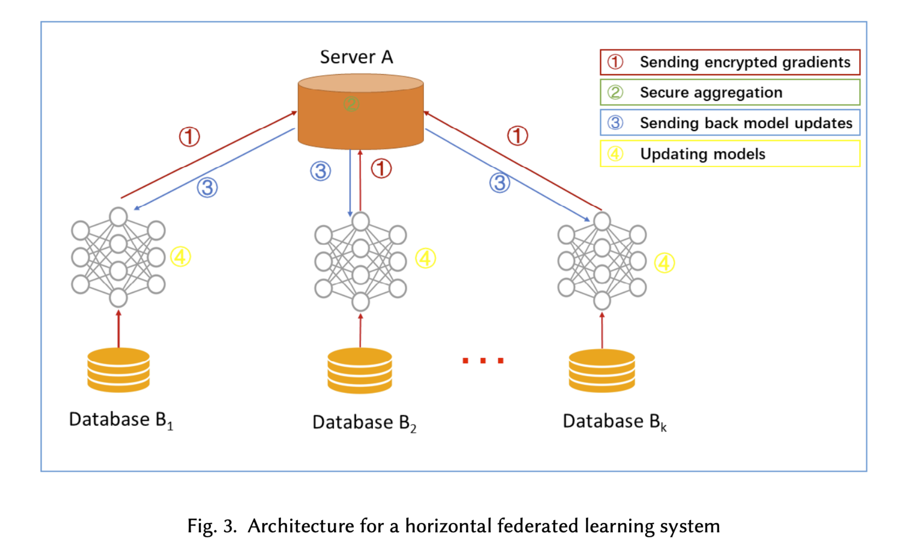
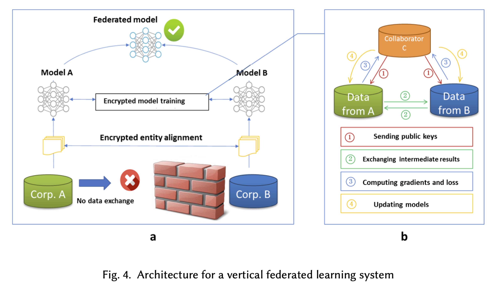
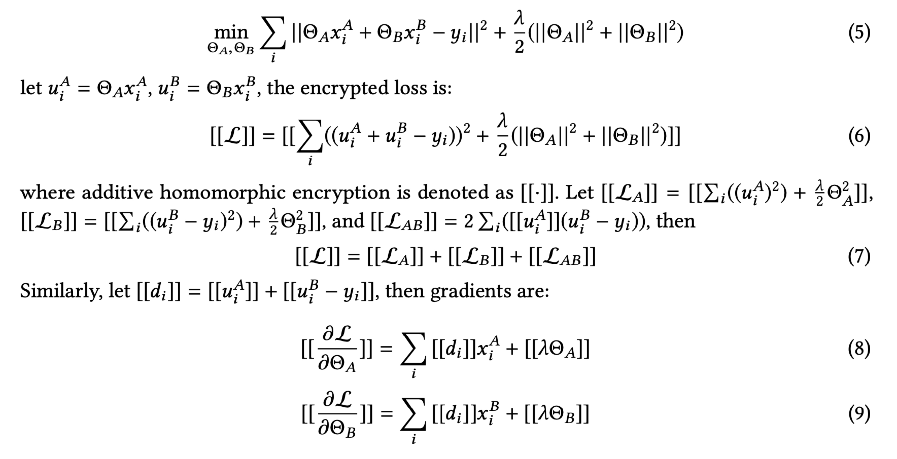

## Federated Machine Learning- Concept and Applications

# 摘要

当下AI面临的两大挑战
1. 数据孤岛
2. 对数据隐私与安全的要求不断加强

本文贡献
1. 针对当下的挑战，我们提供一套可能的解决方法——安全联邦学习。 在2016年google首次提出的联邦学习框架以外，我们提出了一个全面的安全联邦学习框架，包括横向，纵向，迁移联邦学习三种。
2. 我们为这个框架提出了定义，架构及应用，以及一个全面的调研。
3. 我们还提出在组织之间给予联邦机制建立数据网络是一个有效的分享知识同时又保护隐私的方法。

# 1 导论
2016年AI技术开始成熟，AlphaGo打败人类。 我们开始期待更加复杂，尖端的AI技术再更多场景上的应用。包括无人驾驶，医疗，金融等。如今，AI在各个领域开始展现威力。
但是，当我们回顾AI的发展历程时，可以看到AI的发展经历了很多次高低起伏。 AI会有下一次的下降吗？ 如果有，那会是什么原因呢。 
当前公众对AI的兴趣主要是得益于大数据量，2016AlphaGo使用了30w盘比赛作为训练数据才获得这么优秀的结果。

随着AlphaGo的成功，人们很自然的希望像AlphaGo一样由大数据驱动的AI能够很快在我们的生活中方方面面实现。 但是现实有一些令人失望。
除了个别行业是例外，大部分的领域都有有限的或者质量很差的数据，使得AI技术的落地比我们想象的要更加困难。
有没有可能通过跨组织传输数据把数据统一融合在一个地方呢？实际上，在很多情况下打通数据隔阂，即使不是完全不可能，也是非常困难的。
一般来讲，AI项目里需要的数据包含很多类型，比如推荐系统，销售方又产品的信息，用户购买信息，但是没有描述用户购买能力和付费习惯的数据。
大部分行业，数据都是以孤岛的形式存在的。而由于行业竞争，隐私安全，以及各种繁冗的监管流程，即便是同一个公司内部不同部门之间的数据整合都面临巨大的阻力。
想跨组织跨国家去整合散布的数据基本来说谁不可能的，或者成本是无法想象的

同时，随着大企业违反数据安全和用户隐私逐渐被大众开始意识，强调数据隐私及安全已经是一个世界范围的重大问题。
例如之前Facebook滥用数据的事情引起了大范围的抗议。为了回应，全球都开始加强数据安全和隐私的法律。
一个是2018年欧盟的GDPR，目的是保护用户个人隐私和数据安全。 要求企业要用简单直白的语言去描述用户条例，同时要给予用户删除和撤销自己个人数据的权利。违反条例的公司会面临严重的惩罚。
同样的还有美国及中国。2017年中国中华人民共和国网络安全法，要求互联网公司在跟第三方进行数据交互的时候，必须不能泄露或篡改他们收集的个人信息。需要确保提出的合同需要符合合法的数据保护准则。

这些条例很明显帮助建设了更文明的社会，但同时也给我们的AI数据处理流程增加了很多挑战。
具体一点，传统机器学习项目的数据处理比较简单，通常是一方收集传输数据到另一方，然后另一方做数据清洗，最后还有一方拿着整合好的数据进行建模，供多方使用。
在上面的条例下，面临着挑战。由于用户可能不清楚这些模型未来的使用场景，因此这些数据交易就违反了法律，比如GDPR。因此，我们就面临了一个困境，就是这些数据是隔离的孤岛，我们又在很多情况下被禁止去收集融合不同地方的数据。 如何合法的解决这个问题是一个重大的挑战。
本周稳重，我们介绍一个新的方法叫做联邦学习。是这一挑战的可能解决方法。 我们调研现在联邦学习领域的工作，同时提出一个全方位的安全联邦学习框架，包含定义，分类，应用。 我们讨论如何成功地将联邦学习应用在不同的业务中，在推广联邦学习的时候，我们希望AI发展的重点从现在大家重视的提升模型性能，迁移到找寻找遵从数据隐私及安全的数据整合方法上来。

# 2 联邦学习概述
联邦学习的概念最早由google2016年提出。主要的想法是基于分布在不同设备上的数据训练机器学习模型，同时又防止数据泄露。 
最近的研究进展主要集中在
1. 克服统计挑战。 statistical challenge 
2. 改善联邦学习中的安全性。
3. 还有一些让联邦学习更加个性化的研究
这些工作都着重设备上的联邦学习，分散的移动设备用户交互及沟通，不平衡的数据分布，及设备可靠性问题，是优化的主要隐私。

此外，数据根据用户id或者device id来分割，因此也就是横向的数据分割。这一条研究方向跟“隐私保护机器学习”关系很密切，因为它也是关注在分布式机器学习场景下的数据隐私问题。
为了扩展联邦学习的概念到更多组织之间合作学习的场景，我们扩展了原先的联邦学习的概念到一个更广的概念，它包含所有分布式，保护隐私的合作型机器学习技术。
我们之前还给了一个联邦学习的初步概述及联邦迁移学习的技术。 本文，我们进一步调研相关的安全基础，探索和其他相关领域的关系，如multiagent theory， 数据保护数据挖掘，这里我们给一个更全面的联邦学习定义，包含数据分割，安全，和应用。同时描述一下工作流及系统架构。

## 2.1 定义

多个数据拥有者打算拿出各自的数据共同训练一个模型。
- 数据拥有者: { $\mathcal{F}_1, \mathcal{F}_2, \ldots, \mathcal{F}_N$ }
- 数据: $\mathcal{D}_1, \mathcal{D}_2, \ldots, \mathcal{D}_N$
- 传统方法，把所有的数据放在一起$\mathcal{D} = \mathcal{D}_1\cup\dots \mathcal{D}_N$训练一个模型 $\mathcal{M}_{SUM}$ 准确度 $\mathcal{V}_{SUM}$
- 联邦学习方法，所有的数据所有者共同训练一个模型 $\mathcal{M}_{FED}$，同时数据所有者$\mathcal{F}_1$ 不会把他的数据暴露给其他方。同时  $\mathcal{M}_{FED}$的准确度 $\mathcal{V}_{SUM}$
应该很接近于$\mathcal{M}_{SUM}$ 准确度 $\mathcal{V}_{SUM}$。 
- 形式上定义来说另 $\delta$ 做非负实数，
- 如果$\vert\mathcal{V}_{FED} - \mathcal{V}_{SUM}$ < $\delta\vert$ 我们就是这个联邦学习算法有$\delta$ 准确度损失

## 2.2 联邦学习的隐私性
隐私性是联邦学习中一个最核心的性质。这里review对比一下不同的隐私保护技术，及可能预防间接泄露的挑战。

***SMC 安全多方计算***

这种方案包含多方，同时提供了在一个模拟的框架下，证明了安全性，保证数据完全zero knowledge。 也就是每一方除了自己的输入输出意外不知道任何信息。
零知识是非常诱人的，但是这个特性一般需要很复杂的计算协议，效率比较低下。 这个参见姚期智的百万富翁难题的解决方案。

有些场景下，在有安全保证的前提下，部分信息的暴露是可以接受的。因此可以用SMC在低安全要求下构建一个安全模型换取效率。 近期有些研究在使用SMC框架训练机器学习模型。这些工作要求参与者的数据被秘密的分享到诚实的服务器上。

***Differential Privacy 差分隐私***

另一条研究方向是 Differential Privacy 或者k-Anonymity来防止泄露隐私。 主要是在数据中加噪音，或者对于某行敏感属性加泛化处理直至第三方无法识别，从而防
止从加密数据复原出原始数据。 不过，这类方法根本上仍需要将数据传输到另外的地方，而且也会有准确度和隐私的tradeoff问题。

***Homomorphic Encryption 同态加密***

同态加密算法也被在机器学习任务中，利用密码学原理在参数交换时保护用户数据隐私
与差分隐私不同，数据和模型不会进行传输，也无法被猜出来，因此基本不可能在原始数据级别出现信息泄露。近期的工作利用同台加密，在云上集中化训练数据。

### 2.2.1 间接性信息泄露
1. 早起的联邦学习会暴露一些中间结果，例如SGD优化算法里的参数更新，但是没有安全保证，同时这些梯度如果伴随数据结构信息如图像像素，的流出可能会导致重要信息的泄露
2. 研究者考虑了当联邦学习中的某一个成员故意攻击其他成员，提供backdoor去学习其他成员的数据。一些研究证明了可以通过加入一些隐形的后门到一个全局模型中，并提出了一个“约束扩展”模型-毒化方法论，来降低数据毒化。 另外一些研究人员在合作机器学习系统中发现一些潜在的漏洞，使得这些被多方共用的训练数据容易遭到攻击。
他们显示一个恶意成员可以推断出其他成员的身份及训练数据一个子集合的性质。 他们同时讨论了一些对抗这些攻击的手段。 他们暴露出一个在不同成员之间交换梯度的可能的安全隐患，同时提出了一种梯度下降的安全变种，能够容忍一定比例的拜占庭worker
3. 研究人员同时也考虑使用区块链作为联邦学习的平台，提出一种区块链联邦学习架构BlockFL，使得移动设备的本地学习模型通过区块链进行更新和验证，考虑了一种最优的区块生成，网络扩展和健壮性等

## 2.3 联邦学习分类
根据数据分布的特性 对 联邦学习进行分类
$D_i$ 矩阵表示数据拥有者 $F_i$所有的数据，每一行表示一个样例，一列表示特征，有些数据集还会包含标签
- 特征空间 $\mathcal{X}$
- 标签空间 $\mathcal{Y}$
- 样本ID空间 $\mathcal{I}$    如金融场景里，标签就是用户的信用分，在市场领域就是用户的购买意愿分
- 全部训练数据集 ($\mathcal{I}$, $\mathcal{X}$, $\mathcal{Y}$)

特征和样本空间不一定是一样的，根据数据在不同联邦里的特征和样本分布情况，
我们将联邦学习分为
### 2.3.1 水平联邦学习
不同方的数据集有同样的特征空间，但是样本空间不同，如不同的区域银行，业务相似，特征相同，但用户集合不同。

这种情况下，有一些研究提出，各方在本地更新模型参数，同时将参数更新到云端，然后共同训练一个集中的模型。有些研究提出了保护集合用户隐私的方法。
一些研究提出一种多任务联邦学习，允许多方完成不同的任务，同时分享知识和保障安全。 这种方式同时解决了高昂的通信成本，容错等问题。 
还有一些研究提出构建一个安全的client-server结构，使得联邦学习按照用户分割数据，允许在客户端设备上训练的模型能够跟服务端合作共同构建全局的模型。同时这个模型训练过程保证了没有数据泄露。也有一些研究提出了改善通信成本。

总结一下，横向联邦学习描述为

 $\mathcal{X_i}$ =  $\mathcal{X_j}$,  $\mathcal{Y_i}$ =  $\mathcal{Y_j}$,  $\mathcal{I_i} \neq  \mathcal{I_j},  \forall \mathcal{D}_i, \mathcal{D}_j, i\neq j$
 
***安全定义***
一个横向联邦学习系统一般假定参与者是诚实而安全的，但服务器是半诚实的（城市并且好奇），也就是，只有服务端可能会违背参与方的数据隐私。 
这个方面已经给出了安全性证明，近期另一种安全模型考虑到恶意用户的也被提出，使得隐私问题面临额外的挑战。 在训练结束后，全局模型和所有的模型参数都会暴露给所有的参与者。

### 2.3.2 垂直联邦学习
针对垂直切分的数据，有人提出了隐私保护机器学习算法，包括Cooperative Statistical Analysis， association rule mining， secure linear regression， classification， and gradient descent
最近Ref又提出一个垂直联邦学习方案用来训练隐私保护的LR模型。 作者研究了学习表现的实体解析，针对loss和梯度函数采用了泰勒逼近，从而使得同态加密可以在隐私保护计算中被采用。

垂直联邦学习或者叫基于特征的联邦学习，适用于两个数据集有同样的样本ID空间，但是特征空间不同，例如一个城市的两家不同公司，一个是银行，一个是电商。 用户群体很相像，但是银行记录的是用户的资产及开销行为还有信用记录，而电商保留的是用户的浏览及购买历史。特征空间很不一样，而我们想要用双方的数据建立一个预测模型。
垂直联邦学习的过程是，把不同的特征聚合起来，并用隐私保护的方法计算训练loss和梯度，从而使用双方的数据共同训练一个模型。
在这种急之下，参与的各方的身份是一样的，而联邦系统帮助所有参与方实现共同富裕。也就是为什么这种系统叫做联邦学习。
形式描述如下

  $\mathcal{X_i} \neq   \mathcal{X_j},  \mathcal{Y_i} \neq  \mathcal{Y_j}, \mathcal{I_i} =  \mathcal{I_j},  \forall \mathcal{D}_i, \mathcal{D}_j, i\neq j$

***安全定义***
一个垂直联邦学习系统假定参与方是半诚实的（诚实并且好奇）。 以一个两个参与方的例子，双方没有串通，最多有一方会被敌方妥协。 
这个安全定义是，敌方只能从他收买的一方获取数据，而并不能获得任何其他放的数据，除了公开的输入输出。
为了使双方进行安全计算，有时候半诚实第三方STP会被引入，这里假设STP不会跟任何一方串通，每个参与方只拥有跟自己特征相关的模型参数，因此，在推断的时候，
双方需要合作产出最终结果。

### 2.3.3 联邦迁移学习
联邦迁移学习适用于，双方的数据集不仅样本集不同而且特征空间也不同。 考虑两种场景，一个是中国的一家银行，另一个是美国的电商公司。 双方的用户交集很少，同时特征空间也很不同。 这种情况下，可以使用的技术。 特殊情况下，一个共同的表示可以通过两边有限的样本交集学习到，之后被用于单边样本的预测。
 $\mathcal{X_i} \neq   \mathcal{X_j},  \mathcal{Y_i} \neq  \mathcal{Y_j}, \mathcal{I_i} \neq  \mathcal{I_j},  \forall \mathcal{D}_i, \mathcal{D}_j, i\neq j$

***安全定义***
联邦迁移学习系统一般有两方，协议跟垂直联邦学习接近，所以垂直联邦学习的安全定义也可以扩展到这里。

## 2.4 联邦学习系统架构
这里给出联邦学习的通用架构，水平和垂直的架构非常不同，分开介绍

### 2.4.1 水平联邦学习
典型的架构如图，这里面k个参与方有同样的数据结构，在一个参数服务器或者云服务器的帮助下共同训练一个模型。
一个假设是参与方都是诚实的，但是服务器是诚实但好奇的。 所以不允许任何参与放的信息泄露到服务器上。训练过程包含4步
step 1
参与方本地计算训练梯度，使用加密方法（同态加密，差分隐私，或者秘密共享）等技术选择一部分梯度进行加密，然后发往服务器。
step 2
服务器在不从任何参与方获取信息的情况下完成安全聚合
step 3
服务器返回聚合的结果给所有的参与方
step 4
参与方使用解密后的梯度更新各自的模型
上述步骤迭代知道损失函数收敛，完成整个训练过程。 这种架构独立于具体的某种学习算法（LR，DNN等），所有参与方共享最终的模型参数

***安全分析***

上述架构被证明 可以对抗半诚实的服务器保护数据泄露，。如果梯度聚合是采用了SMC（安全多方计算）或者是同态加密
但是在其他的模式下可能会被恶意的参与方通过在联合训练过程中训练一个GAN来攻击。

### 2.4.2 垂直联邦学习
假设公司A B希望共同训练一个模型，他们各自有自己的数据，同时B拥有模型需要预测的标签数据。考虑到隐私和安全的原因，A和B不同交换数据。为了确保数据的保密性，引入第三方C。 假设C是诚实的不会和A或B串通，但是A和B都是诚实且好奇的。 AB可以信任C，因为这里C可以由政府或其他比较权威的机构担任。 
这个联邦学习系统包含两部分。

part1 加密的样本对齐 Encrypted entity alignment 
双方的用户群不同，系统使用加密的用户ID对齐的技术来找出双方的共同用户，同时不需要A或者B暴露各自的数据。 在样本对齐的时候，系统不会暴露给参与方他们没有交集的那部分数据集。
part2 加密模型训练
在确定了共同的ID后，使用这些共同ID的数据进行训练，分为4步
step1 合作方C生成密钥对，把公钥发给A和B
step2 A和B加密并交换梯度及loss计算的中间结果
step3 A和B计算加密的梯度，同时添加额外的mask，同时计算加密的loss，AB把加密的结果发给C
step4 C把收到的数据解密，把解密后的梯度和loss返回给A和B，A和B unmask这些梯度，分别更新各自的模型参数。
这里拿线性回归和同态加密作为例子，来演示训练过程。

为了使用梯度下降的方法训练线性回归模型，需要安全计算loss和梯度。 假设学习率，正则化lambda，数据集。 模型参数。 特征空间等。
训练目标是
加密损失就是
这里面加法同态加密表示为。 （加法同态加密，保证这个加法运算是正确的）

训练步骤如下

在样本对齐和模型训练时，AB的数据都放在了本地，训练过程中的数据交互没有导致数据隐私泄露。 
注意到，这里面可能的数据泄露到C可能会被认为违背了隐私性。 为了进一步阻止C从A或 B种获取信息，A和B可以进一步往梯度里添加加密的随机mask防止泄露给C。
于是，双方在联邦学习的帮助下达到了共同训练一个魔性的目的。 因为在训练过程中，各方获得的loss和梯度，和他们不考虑隐私问题把数据放在一起联合训练模型得到的梯度完全一样。 

因此可以认为这个模型是无损的。
这个模型的效率取决于通信成本和加密数据的计算成本。 在每一个迭代中发往A和B的数据量取决于共同数据集的量。 因此这个算法可以通过采用分布式并行计算的技术来进一步优化效率。

***安全分析***
表1重的训练协议没有把数据泄露给C，因为C学到的都是masked的梯度，而随机性和私密性已经是被证明的。 在上述协议中，A每一步学到梯度，但是这并不能让A学到任何关于B的信息，根据公式8. 因为标量乘积协议的安全性被很好的建立了，给予无法通过大于n个未知数的方程解n个方程。 我们假设Na远大于na （na是特征的个数）。
同样的B也不能从Å获得任何信息。 因此这个协议的安全性是被证明的。
注意到我们假设两个参与方都是半诚实的，如果有一方是恶意的，通过伪造假输入数据欺骗系统，比如A提交了一个只含有一个非零特征的非零数据，它可以判断出B方给出的相应样本的特征。 但是仍然不可以判断。。。 同时方差会是结果在下一轮扭曲，警告另一方终结学习过程。 在学习结束后，每一方仍然对对方的数据结构没有察觉，同时也只能获取自己那部分特征的模型参数。 推断的时候，双方需要协作计算预测结果，依然不会导致数据泄露。

### 2.4.3 联邦迁移学习
假设在上面的纵向联邦学习中，A和B都只有一小部分重合样本集，而我们希望学习A的所有数据集的label。 上面的架构只能支持重合部分的数据集。 为了扩展到整个样本及，这里引入迁移学习。 这个没有改变整体的架构，但是会改变AB互相交换的中间结果的细节。 具体讲，迁移学习，会从AB的特征集中学到一个共同表示，然后通过利用源数据方B的label去最小化预测目标方A的样本的误差。 因此A，B的梯度计算方法也和纵向学习里不同。推断的时候，同样需要双方共同计算预测结果。

### 2.4.4 激励机制
为了让联邦学习在不同组织里推广商业化，需要开发一个一个公平的平台和激励机制。 模型建立后，模型的表现会在应用中表现出来，模型的表现可以被永久存下来比如用区块链。 提供更多数据的组织要更多的收益，模型的有效性页依赖于数据提供方对系统的贡献。 模型的有效性可以根据联邦机制分享到不同的合作方，同时激励更多的组织加入。
上述架构不仅考虑了隐私保护同时兼顾了多组织合作学习的有效性，同时也考虑到如何奖赏贡献更多数据的组织，并用一个大家一致同意的方案实现激励。因此联邦学习是一个闭环的学习机制。

# 3 相关工作
联邦学习使得多方可以合作构建机器学习模型，同时保护各自的数据隐私，作为一个新的技术，它可以有多条路线追溯源头，其中一些基于现存的领域。 这里从多个角度介绍一下联邦学习和其他相关领域的关系

## 3.1 安全保护机器学习 Privacy-preserving machine learning
联邦学习可以被认为是隐私保护去中心化联合机器学习，他跟多方隐私保护机器学习有紧密联系。
过去有很多这个领域的研究。 Ref提出锅纵向划分数据的安全多方决策树算法，Vaidya提出了安全mining rules， 安全k-means， 朴素贝叶斯。
Ref也提出锅一个横向数据分割的关联规则算法。 还有安全SVM算法，安全多方LR算法，安全多方梯度下降算法等。 
上述工作都用到了SMC安全多方计算来保障隐私。
Nikolaenko实现了横向数据集的隐私保护协议，基于同态加密及姚的混乱电路。 Ref提出过纵向数据的线性回归算法。 这些系统都直接解决了线性回归问题。
Ref采用SGD方法同时给LR和NN模型提出了安全保护协议。 等等。

## 3.2 联邦学习与分布式机器学习 Federated Learning vs Distributed Machine Learning
横向联邦学习，乍一看有点像分布式机器学习。 分布式机器学习包含很多方面，包括训练数据的分布式存储，计算任务的分布式运行，模型结果的分布式分散等。
参数服务器就是分布式机器学习里的重要元素。 作为一个加速训练过程的工具，参数服务器将数据存储在分布的工作节点上，把数据和计算资源通过一个中心的调度节点进行分配，使得模型训练更加高效。
对于横向联邦学习，工作节点就代表着数据拥有方。它对自己本地数据有全部权限，能够决定何时及如何加入联邦学习。 在参数服务器上，中心节点总是掌握控制权，所以联邦学习面临一个更复杂的学习环境。另外联邦学习强调训练过程中数据所有者的数据隐私保护。有效的保护数据隐私的方法能够应对未来更加严格的数据监管环境。
想分布式机器学习的设定一样，联邦学习同样需要处理Non-IID数据。有研究显示，对于Non-IID的本地数据，联邦学习性能会大幅降低，同时作者提供了一个解决这个类似迁移学习问题的方法

## 3.3 联邦学习与边缘计算
联邦学习可以视为边缘计算的操作系统，因为它提供了协调和安全的学习协议。 有研究考虑了一类泛型的基于梯度下降的机器学习模型。 他们从理论角度分析分布式梯度下降的收敛边界，基于这个研究，他们提出一种公职算法，可以决定本地更新和全局参数聚合的最好的trade-off，使得在给定资源预算的情况下最小化loss函数。

## 3.4 联邦学习与联邦数据库系统
联邦数据库系统是一种集成多个数据库但愿并集中管理的一种系统。 联邦数据库的概念的提出是为了解决多个独立数据库互操作性问题。一个联邦数据库系统经常为每个数据库但愿使用分布式存储，而每个数据库的数据单元是多种多样的。

因此它跟联邦学习在数据类型及存储上有很多共同性。 但是，联邦数据库系统并不包含多方数据库交互过程中的隐私保护机制，所有的数据库但愿对整个管理系统是完全可见的。
此外，联邦数据库系统的中心是在数据的基础操作，如插入删除，搜索，合并等。而联邦学习的目的是为了合作构建一个模型服务所有数据所有方。

# 4 应用
作为一个能够在保护数据隐私的前提行利用多方数据训练模型的机制，有很多应用场景。销售，金融等。
1. 只能销售，结合银行数据，社交数据，及电商的产品数据，用户购买数据。数据隐私问题，分散在多方，数据异质性等阻碍了发展。联邦学习很好解决。
2. 银行里的多方借贷，恶意从一个银行借钱还另个银行的贷款，大规模的多方借贷可能会导致整个金融体系瓦解。联邦学习在银行之间不共享数据的情况下找到这种用户。
简单的对借贷用户列表进行加密，然后求交。
3. 智能医疗，医疗数据如疾病，基因序列，医疗报告都很敏感而隐私，医疗数据分散在各个医疗机构很难集中收集，一些数据缺少标注，可以展望，未来医疗机构联合起来共享数据，训练出来的模型的效果会大大提升。

# 5 联邦学习和企业数据联盟

联邦学习不仅是一个技术标准，同样是商业模式，当人们意识到大数据的效果，第一个想法就是把数据整合起来，在远端处理，然后把结果下载下来使用。 云计算支持了这个需求，但是随着数据隐私和安全问题被重视，云计算模式面临挑战，而联邦学习提供了一个新的范式。 同时公平合理的机制可以保障参与方的利益，这样就会有更多的组织加入数据联盟。

# 6 结论及展望
近年来，数据孤岛化及数据隐私的重视，成为了AI发展的下一个挑战，而联邦学习给我们带来了新的希望。 它可以为多方建立一个联合的模型同时保障各自的本地数据被保护。
所以各方在数据安全被保障的全体下可以实现共赢。 本文宏观的介绍了联邦学习的基本概念，架构，以及技术，讨论了未来的潜在应用。 期望在不远的将来，联邦学习会打破各个行业直接的壁垒，构建一个数据和只是可以被安全共享的社区，而这个利益也会被公平的根据各个参与方的贡献分配给大家。AI的红利会最终被带到我们生活的每一个角落。
