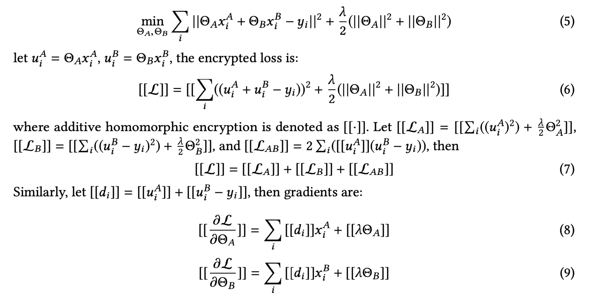

## Federated Machine Learning- Concept and Applications

# 0 背景与摘要
**项目背景**
- 滴滴与腾讯合作联邦学习，期望提升广告CTR

**作者杨强**
- 国际“迁移学习”和“联邦学习”领域发起人，带头人
- 微众银行首席人工智能官
- AAAI首位华人院士

**文章**
- 联邦学习领域较早期的综述
- 杨强著《联邦学习》书的内容来源

**当下AI面临的两大挑战**
- 数据孤岛问题
- 对数据隐私与安全的要求不断加强

**本文贡献**
- 在Google的基础上，提出全面的**安全联邦学习**框架，包括横向，纵向，联邦迁移学习三种。
- 为这个框架给出了定义，架构及应用，以及一个全面的调研
- 推广未来在不同组织之间**基于联邦机制**分享知识同时保护隐私

# 1 导论
**AI近些年快速发展得益于能够获取大量训练数据**
- 2016年AlphaGo，无人驾驶，医疗，金融等
- 海量数据的获取

**当前的瓶颈： 1.数据孤岛**
- 大部分的领域都只有**很有限的或者质量很差的数据**
- 推荐系统有产品的信息，用户购买信息，**无**用户购买能力和付费习惯的数据（银行数据）
- 行业竞争，商业机密，监管流程，**很难融合多方数据**

**当前的瓶颈： 2.数据隐私与安全**
- 全世界范围开始重视数据隐私及安全
- Facebook滥用数据引发抗议， 近期国内互联网安全事件
- 2018年欧盟的GDPR
- 2017年中国中华人民共和国网络安全法

**一种解决方案：联邦学习**
- 本文介绍一个可能的解决方案——联邦学习。
- 希望未来AI发展， 提升模型性能 ---> 找寻保护数据隐私及安全的数据整合方法

# 2 联邦学习概述
**早期Google提出的联邦学习**
- 2016年提出
- 分布在不同**安卓终端设备**上的数据共同训练机器学习模型，同时防止数据泄露

**本文提出了更广的概念**
- 扩展了原先的联邦学习的概念到一个更广的概念，跨组织合作学习
- 给一个更全面的联邦学习定义，包含数据分割，数据安全，应用，工作流及系统架构

## 2.1 定义

多个数据拥有者拿出各自的数据共同训练一个模型。
- 数据拥有者: {$\mathcal{F}_1, \mathcal{F}_2, \ldots, \mathcal{F}_N$}
- 数据: {$\mathcal{D}_1, \mathcal{D}_2, \ldots, \mathcal{D}_N$}

**传统方法**
- 所有数据放在一起$\mathcal{D} = \mathcal{D}_1\cup\dots \mathcal{D}_N$
- 使用$\mathcal{D}$训练一个模型 $\mathcal{M}_{SUM}$，准确度为$\mathcal{V}_{SUM}$

**联邦学习方法**
- 所有的数据所有者共同训练一个模型 $\mathcal{M}_{FED}$
- 同时数据所有者$\mathcal{F}_i$ 不会把他的数据暴露给其他方
- 模型$\mathcal{M}_{FED}$的准确度 $\mathcal{V}_{FED}$ 应该很接近于$\mathcal{M}_{SUM}$ 准确度 $\mathcal{V}_{SUM}$
- 令 $\delta$ 做非负实数，如果$\vert\mathcal{V}_{FED} - \mathcal{V}_{SUM}\vert < \delta$， 该联邦学习算法有$\delta$准确度损失

## 2.2 联邦学习的隐私性
隐私性是联邦学习中一个核心的性质，联邦学习里常用的隐私保护技术

***SMC 安全多方计算***
- 一种在保护各方隐私的前提下实现**隐私数据共享**的机制
- 参考姚期智百万富翁难题，该方案有理论证明可以保证zero knowledge泄露
- 完全zeroknowledge一般需要很复杂的计算协议，效率比较低下
- 有些场景下，在有安全保证的前提下，部分信息的暴露是可以接受的

***Differential Privacy 差分隐私***
- 顾名思义，保护的是数据源中一点微小的改动导致的隐私泄露问题
- 主要是在数据中加噪音，或者对于某行敏感属性加泛化处理直至第三方无法识别
- 这类方法根本上仍需要将数据传输到另外的地方，而且也会有准确度和隐私的tradeoff问题

例：
- 数据库中可以查询出单身的人数为2
- 张三作为一个新样本加入后，再次查询数据库中单身人数变成了3
- 张三的出现，使得攻击者获得了奇怪的知识
- 而差分隐私需要做到的就是使得攻击者的知识不会因为这些新样本的出现而发生变化
- 具体做法：加入随机噪声。本来两次查询结果是确定的2和3，现在加入随机噪声后，变成了两个随机变量，给出它们概率分布图
<!-- <figure class="half">
</figure> -->

***Homomorphic Encryption 同态加密***
- 对经过同态加密的数据进行处理得到一个输出，将这一输出进行解密，其结果与用同一方法处理未加密的原始数据得到的输出结果是一样的
- 例： 加法同态加密算法$[[\centerdot]]$  满足$[[A + B]] = [[A]] + [[B]]$ 

- 盒子：加密算法
- 盒子上的锁：用户密钥
- 将金块放在盒子里面并且用锁锁上：将数据用同态加密方案进行加密
- 加工：应用同态特性，在无法取得数据的条件下直接对加密结果进行处理
- 开锁：对结果进行解密，直接得到处理后的结果

- 与差分隐私不同，数据和模型不会进行传输，也无法被猜出来，因此基本不可能在原始数据级别出现信息泄露

## 2.3 联邦学习分类
本文根据数据分布的特性对联邦学习进行分类
- $\mathcal{D}_i$ 矩阵表示数据拥有者 $\mathcal{F}_i$所有的数据
- 每一行表示一个样例，一列表示特征，有些参与方数据包含标签
- 特征空间 $\mathcal{X}$
- 标签空间 $\mathcal{Y}$ 
- 样本ID空间 $\mathcal{I}$    
- 全部训练数据集 ($\mathcal{I}$, $\mathcal{X}$, $\mathcal{Y}$)

### 2.3.1 横向联邦学习
- 不同参与方数据集有同样的特征空间
- 样本ID交集较少
- 例：不同区域的地方银行业务相似，特征相同，用户集合不同

**形式描述**
 $\mathcal{X_i}$ =  $\mathcal{X_j}$,  $\mathcal{Y_i}$ =  $\mathcal{Y_j}$,  $\mathcal{I_i} \neq  \mathcal{I_j},  \forall \mathcal{D}_i, \mathcal{D}_j, i\neq j$
 
**横向联邦学习系统安全定义**
- 假定参与方是诚实而安全的
- 聚合方是诚实且好奇的，因此只有聚合方服务端可能会侵害参与方的数据隐私
- 以上假定下的安全性已经有研究者给出理论证明
- 训练结束后，整个全局模型及模型参数会暴露给所有的参与方
- 存在恶意攻击用户的情况下的安全问题也在被研究中

**这个领域的一些研究状况**
- Google 提出一套框架，不同安卓用户在本地更新模型参数，然后上传到安卓云，实现共同训练模型
- Le Trieu Phong提出用同态加密实现在保障安全的前提下实现中心服务器的参数集成
- 各方在本地更新模型参数，同时将参数更新到云端，然后共同训练一个集中的模型。有些研究提出了保护集合用户隐私的方法
- Virginia Smith提出一种多任务联邦学习，允许多方完成不同的任务，同时分享知识和保障安全。 这种方式同时解决了高昂的通信成本，容错等问题
- H. Brendan McMahan 提出构建一个安全的client-server结构，使得联邦学习按照用户分割数据，允许在客户端设备上训练的模型能够跟服务端合作共同构建全局的模型。同时这个模型训练过程保证了没有数据泄露。也有一些研究提出了改善通信成本

**横向联邦学习架构**
- 每个参与方有同样的数据结构
- 在一个参数服务器或者云服务器的帮助下共同训练一个模型
- 一个假设是参与方都是诚实的，但是服务器是诚实但好奇的。 所以不允许任何参与方的信息泄露到服务器上

**训练步骤**
1. 参与方本地计算训练梯度，使用加密方法（同态加密，差分隐私，或者秘密共享）等技术选择一部分梯度进行加密，然后发往服务器
2. 服务器在不从任何参与方获取信息的情况下完成安全聚合
3. 服务器返回聚合的结果给所有的参与方
4. 参与方使用解密后的梯度更新各自的模型
5. 上述步骤迭代直到损失函数收敛，完成整个训练过程
这种架构独立于具体的某种学习算法（LR，DNN等），所有*参与方共享最终的模型参数*

***安全分析***
- 上述架构被证明，梯度聚合是采用了SMC（安全多方计算）或者是同态加密，则可以对抗半诚实的服务器防止数据泄露
- 但是在其他的模式下，可能会被恶意的参与方通过在联合训练过程中训练一个GAN来攻击

### 2.3.2 纵向联邦学习
- 不同参与方数据样本ID重合较大
- 数据特征空间重合较小
- 例：一个城市的两家不同公司银行和电商。 用户群体很相像，银行记录的是用户的资产，消费及信用记录，电商保留的是用户的浏览及购买历史

**形式描述**
  $\mathcal{X_i} \neq   \mathcal{X_j},  \mathcal{Y_i} \neq  \mathcal{Y_j}, \mathcal{I_i} =  \mathcal{I_j},  \forall \mathcal{D}_i, \mathcal{D}_j, i\neq j$

**研究现状**
- 针对垂直切分的数据，有研究实现了一些隐私保护机器学习算法，包括Cooperative Statistical Analysis， association rule mining， secure linear regression， classification， 及gradient descent
- 最近又提出一个垂直联邦学习方案用来训练隐私保护的LR模型。 作者研究了学习表现的实体解析，针对loss和梯度函数采用了泰勒逼近，从而使得同态加密可以在隐私保护计算中被采用

***纵向联邦学习安全定义***
- 假定参与方是诚实并且好奇的
- 以一个两个参与方的例子，双方不会互相串通，最多有一方会被敌方收买
- 即使敌方收买了其中一方，也只能从他收买的一方获取数据，而并不能获得任何其他方的数据
- 为了使双方进行安全计算，有时候半诚实第三方STP(Semi-honest Third Party)会被引入，这里假设STP不会跟任何一方串通，每个参与方只拥有跟自己特征相关的模型参数
- 在推断的时候，双方需要合作产出最终结果

**纵向联邦学习架构**
- 假设公司A B希望共同训练一个模型，他们各自有自己的数据，同时B拥有模型需要预测的标签数据
- 考虑到隐私和安全的原因，A和B不能直接交换数据。为了确保数据的保密性，引入第三方C
- 假设C是诚实的不会和A或B串通，但是A和B都是诚实且好奇的
- AB可以信任C，因为这里C可以由政府或其他比较权威的机构担任

这个联邦学习系统包含两部分 
1. 加密的样本对齐 Encrypted entity alignment 
    - 双方的用户群不同，系统使用加密的用户ID对齐的技术来找出双方的共同用户
    - 在样本对齐的时候，系统不会暴露给参与方他们没有交集的那部分数据集
2. 加密模型训练 Encrypted model training

确定了求教数据ID之后，可以用这些ID的数据训练模型
这里拿线性回归和同态加密作为例子，来演示训练过程
**梯度下降，损失和梯度安全计算原理**
- Learning rate $\eta$
- Regularization parameter $\lambda$
- $y_i$, B方的标签空间
- 数据集 $\{x^A_i\}_{i\in\mathcal{D_A}}, \{x^B_i, y_i\}_{i\in\mathcal{D_B}}$
- 模型参数 $\Theta_A, \Theta_B$, 分别对应的特征空间$x^A_i, x^B_i$
- $u^A_i$，定义为$u^A_i=\Theta_A x^A_i$
- $u^B_i$，定义为$u^B_i=\Theta_B x^B_i$
- $[[\centerdot]]$ 加法同态加密算法(AHE Additive Homomorphic Encryption)
- $R_A, R_B$，分别表示A方和B方的随机掩码
训练目标

**模型训练步骤**
1. 合作方C生成密钥对，把公钥发给A和B
2. A和B加密并交换中间结果，用来做梯度及loss计算
3. A和B计算加密的梯度，同时添加附加掩码（additional mask），同时计算加密的loss，AB把加密的结果发给C
4. C把收到的数据解密，把解密后的梯度和loss返回给A和B，A和B unmask这些梯度，分别更新各自的模型参数

- 在样本对齐和模型训练时，AB的数据都放在了本地，训练过程中的数据交互没有导致数据隐私泄露。 
- 注意到，这里面可能的数据泄露到C可能会被认为违背了隐私性。 为了进一步阻止C从A或 B种获取信息，A和B可以进一步往梯度里添加加密的随机mask防止泄露给C。
- 于是，双方在联邦学习的帮助下达到了共同训练一个模型的目的。 因为在训练过程中，各方获得的loss和梯度，和他们不考虑隐私问题把数据放在一起联合训练模型得到的梯度完全一样。 因此可以认为这个**模型是无损的**

**模型推断步骤**

**模型效率**
- 模型的效率取决于通信成本和加密数据的计算成本
- 在每一个迭代中发往A和B的数据量取决于共同数据集的量
- 可以通过采用分布式并行计算的技术来进一步优化效率

***安全分析***
- 训练协议没有把数据泄露给C，因为C学到的都是加了掩码的梯度
- A每一步学到梯度，但是这并不能让A学到任何关于B的信息，反之同理
- 整个协议的安全性有相关密码学理论证明

**关于移除第三方**
- 实际情况中，将第三方加入此过程并不总是可行的，第三方合法性和可问责性难以保障
- 如果采用SMC安全多方计算，可以用于移除第三方，有一些相关的研究

### 2.3.3 联邦迁移学习
- 双方的数据集不仅样本集不同
- 特征空间也不同
- 例：一个是中国的一家银行，另一个是美国的电商公司

**形式定义**
 $\mathcal{X_i} \neq   \mathcal{X_j},  \mathcal{Y_i} \neq  \mathcal{Y_j}, \mathcal{I_i} \neq  \mathcal{I_j},  \forall \mathcal{D}_i, \mathcal{D}_j, i\neq j$

***安全定义***
- 联邦迁移学习系统一般有两方，协议跟纵向联邦学习接近
- 所以纵向联邦学习的安全定义也可以扩展到这里

**联邦迁移学习架构**
- 架构可以沿用纵向联邦学习
- 引入联邦学习，会改变AB互相交换的中间结果的细节，包括计算梯度的方法等

# 3 总结与其他
## 3.1 激励机制
- 为了推广商业化，需要一个公平的平台和激励机制
- 根据各方贡献，将模型带来的利益分享到不同的参与方

## 3.2 联邦学习与相关领域
**联邦学习与安全保护机器学习**
- 联邦学习可以认为是*隐私保护去中心化联合机器学习*，跟多方隐私保护机器学习有紧密联系
- 该领域提出的很多隐私保护算法有在联邦学习领域使用如，SMC，混乱电路等

**联邦学习与分布式机器学习**
- 都需要考虑训练数据的分布式存储，计算任务的分布式运行，模型结果的发布
- 和分布式机器学习的设定一样，需要处理Non-IID数据

**联邦学习与边缘计算**
- 联邦学习可以视为边缘计算的操作系统，因为提供了协调和安全的学习协议

**联邦学习与联邦数据库系统**
- 联邦数据库的概念的提出是为了解决多个独立数据库互操作性问题
- 联邦数据库系统不包含多方数据库交互过程中的隐私保护机制，所有的数据库对整个管理系统完全可见
- 联邦数据库系统的中心是在数据的基础操作，如插入删除，搜索，合并等- 而联邦学习的目的是为了合作构建一个模型服务所有数据所有方

## 3.3 应用
- 智能销售，结合银行数据，社交数据，及电商的产品数据
- 银行里的多方借贷问题，主要做数据求交找出同时在不同银行做借贷的用户集，同时不暴露银行的其他用户
- 智能医疗，医疗数据如疾病，基因序列，医疗报告都很敏感而隐私

## 3.4 联邦学习展望
- 呼吁各方组织加入数据联盟
- 解决数据孤岛化，保障各方数据隐私安全
- 打破各个行业直接的壁垒，构建数据和知识可以被安全共享的社区
- 联邦学习保证利益公平分配，实现共赢
